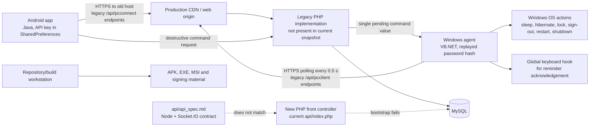

# PCConnect Whole-Repository Audit

**Audit date:** 26 August 2026  
**Authoritative snapshot:** working tree at Git `17bd411` before this report was created  
**Scope:** current PHP API, Android app, VB.NET Windows client, SQL dump, documentation, build/signing artifacts, and passive production observations  
**Production target checked:** `https://pcconnect.adamdeveloping.co.uk/`  
**Out of scope:** implementation review of the deleted Wails, Node, and Flutter stacks; authenticated or state-changing production tests; use or validation of any discovered credential

> Sensitive values and personal records are intentionally omitted. Paths and line numbers identify evidence without reproducing secrets.

## Executive summary

PCConnect is not currently represented by one coherent, deployable architecture. The Android and Windows clients call legacy PHP endpoints on an older hard-coded hostname; those endpoint implementations are absent from the current working tree. The replacement front-controller API cannot bootstrap because four required classes are empty and the reminder controller is not PHP code. Its queries also target columns that do not exist in the supplied schema. The documented Node/Socket.IO architecture has meanwhile been deleted, and the documented production path returned 404 during passive verification.

The most urgent security risks are live-looking service credentials in source, a database export containing authentication material and personal data, replayable SHA-256 password verifiers, long-lived bearer API keys stored insecurely on clients, and a remote power-control protocol without delivery integrity or replay protection. These risks matter more than normal web-app issues because a compromised account or command channel can cause a Windows machine to sleep, lock, sign out, restart, or forcibly shut down.

| Severity | Count | Meaning |
|---|---:|---|
| Critical | 4 | Immediate compromise, sensitive-data exposure, or a release-blocking architectural failure |
| High | 10 | Likely serious security or reliability impact requiring near-term remediation |
| Medium | 13 | Material weakness that increases attack surface, outage probability, or maintenance cost |
| Low | 2 | Limited direct impact but worth correcting during normal hardening |

### Immediate containment

1. Rotate the database credential and CAPTCHA secret referenced in `api/db_config.php` and `api/signup.php`. Treat both as compromised without attempting to test them.
2. Inventory and revoke existing API keys. If the SQL dump has left approved storage or been shared, follow the applicable incident and privacy process and require affected password resets.
3. Move the SQL export and all signing keys into access-controlled secret/artifact storage. Confirm that backup/sync copies and Git history do not retain them before considering containment complete.
4. Do not deploy the current front-controller API. Keep destructive remote commands disabled or restricted to a controlled test population until authentication and command delivery are redesigned and tested.
5. Redirect all HTTP traffic to HTTPS and enable HSTS at the CDN/origin after confirming every supported subdomain is HTTPS-ready.

## Current-state architecture

### Trust boundaries and primary assets

- **Public network boundary:** mobile and desktop clients send bearer API keys and receive commands/reminders through a public web origin.
- **Application/database boundary:** PHP code maps API keys and PC names to user, command, reminder, and time records.
- **Privilege boundary:** the Windows agent converts remote strings into native power/session operations and installs a global keyboard hook.
- **Device-storage boundary:** Android preferences and VB.NET user settings retain authentication material across restarts.
- **Build/release boundary:** the repository contains release binaries, installers, package payloads, and signing key material.
- **High-value assets:** database credentials, CAPTCHA secret, API keys, replayable password hashes, PII, verification tokens, command state, signing keys, and endpoint/domain configuration.

## Security findings

### SEC-001 — Service secrets and signing keys are co-located with source

**Severity:** Critical | **Confidence:** High | **CWE:** CWE-798 | **Effort:** Small to rotate; medium to redesign  
**Affected:** PHP deployment, CAPTCHA, Android and Windows release signing  
**Evidence:** `api/db_config.php:4-7`, `api/signup.php:14-16`, `App/Key Store/PCConnectKey.jks`, `PCClient/PCClient/PCClient_TemporaryKey.pfx`, `PCClient/PCClient/PCClient_1_TemporaryKey.pfx`; the PHP and PFX files are untracked but not ignored.

The PHP files contain embedded live-looking database and CAPTCHA credentials. Signing key files sit inside developer project trees, and the PFX patterns are not covered by the root `.gitignore`. Liveness and key passwords were deliberately not tested. Anyone who obtains a working copy, synced folder, archive, or accidental commit may gain database/CAPTCHA access or signing capability.

**Recommendation:** rotate the service secrets immediately; load runtime secrets from a deployment secret manager or environment; keep signing keys in a protected signing service or restricted keystore; add deny rules for PFX/P12 and local secret configuration; add pre-commit and CI secret scanning. Rotation is independent of all other fixes.

### SEC-002 — The repository workspace contains a populated database export

**Severity:** Critical | **Confidence:** High | **CWE:** CWE-200 | **Effort:** Medium | **Dependencies:** privacy/incident owner  
**Affected:** all users and stored application data  
**Evidence:** `DB/pcconnect.sql:39`, `DB/pcconnect.sql:1887`, `DB/pcconnect.sql:3816`, `DB/pcconnect.sql:8435`, `DB/pcconnect.sql:10224`; the 719 KB file is ignored but present.

The export includes API-key records, names, email addresses, dates of birth, password hashes, reminder data, verification codes, and IP addresses. Ignoring a file prevents a new Git add but does not protect local sync, backups, archives, support bundles, malware, or prior copies. The dump also makes the weak password scheme materially easier to attack offline.

**Recommendation:** move production-like data to encrypted, access-controlled backup storage; replace development data with deterministic synthetic fixtures; determine where this dump has been copied; revoke API/verification tokens and reset passwords if exposure cannot be ruled out; define retention and deletion controls. Do not merely delete the local copy before completing the exposure inventory.

### SEC-003 — Passwords use unsalted, fast SHA-256 and the hash is a reusable credential

**Severity:** High | **Confidence:** High | **CWE:** CWE-916, CWE-522 | **OWASP:** API2:2023 | **Effort:** Large  
**Affected:** PHP login/signup, Android login, Windows login, database  
**Evidence:** `api/signup.php:72`, `api/login.php:15-27`, `App/app/src/main/java/com/adamkhattab/pcconnect/LoginActivity.java:125-139`, `PCClient/PCClient/Login.vb:21-34`, `PCClient/PCClient/Login.vb:90-102`, `DB/pcconnect.sql:8420-8429`.

Clients hash passwords once with SHA-256, and the server compares that value directly. The database has no per-user salt or work factor. The Windows client stores and resubmits the hash, so it is password-equivalent: stealing it permits login without knowing the original password. SHA-256 is intentionally fast and unsuitable for password storage according to [OWASP password-storage guidance](https://cheatsheetseries.owasp.org/cheatsheets/Password_Storage_Cheat_Sheet.html).

**Recommendation:** send the password only over TLS, hash server-side with `password_hash()` using Argon2id (or bcrypt where necessary), and verify with `password_verify()`. Migrate on successful login or require resets; invalidate stored client verifiers; add a versioned hash format and rate-limited migration path. This depends on SEC-002 and SEC-007 containment.

### SEC-004 — Bearer API keys have no visible lifecycle or scope

**Severity:** High | **Confidence:** High | **CWE:** CWE-613, CWE-522 | **OWASP:** API2:2023 | **Effort:** Large  
**Affected:** API, Android app, Windows agent  
**Evidence:** `api/login.php:34-43`, `api/signup.php:75-82`, `App/app/src/main/java/com/adamkhattab/pcconnect/SharedPrefManager.java:24-36`, `PCClient/PCClient/PCClient.vb:157-165`.

Login returns a stable API key as the entire response. No expiration, rotation, revocation timestamp, audience, per-device scope, last-use record, or hashed-at-rest representation is present in current code/schema. One key appears to authorize reminders, device enumeration, and destructive actions across PCs.

**Recommendation:** replace static account-wide keys with short-lived access tokens and rotating, device-bound refresh credentials; store only token hashes server-side; scope tokens by device and capability; expose revocation and session inventory; log issuance and destructive use without logging the token. This requires a coherent schema and API contract (ARCH-001 through ARCH-003).

### SEC-005 — Android stores the bearer key in plaintext and includes it in backup/transfer scope

**Severity:** High | **Confidence:** High | **CWE:** CWE-312, CWE-922 | **Effort:** Medium  
**Affected:** Android authentication and remote-command authorization  
**Evidence:** `App/app/src/main/java/com/adamkhattab/pcconnect/SharedPrefManager.java:7-36`, `App/app/src/main/AndroidManifest.xml:11-14`, `App/app/src/main/res/xml/backup_rules.xml:8-12`, `App/app/src/main/res/xml/data_extraction_rules.xml:6-18`.

The API key is stored as an ordinary `SharedPreferences` string. Backups are enabled and both rules files are effectively empty, so the preference is not excluded from cloud backup or device transfer. Android recommends excluding particularly sensitive data from backup in its [backup security guidance](https://developer.android.com/privacy-and-security/risks/backup-best-practices).

**Recommendation:** keep refresh material behind an Android Keystore-protected design, minimize token lifetime, and explicitly exclude the credential preference from both legacy and Android 12+ backup rules. Add backup/restore tests and force server-side rotation after device migration. SEC-004 should define the replacement credential first.

### SEC-006 — Destructive commands lack end-to-end integrity and delivery guarantees

**Severity:** High | **Confidence:** High | **CWE:** CWE-345, CWE-285 | **OWASP:** API6:2023 | **Effort:** Large  
**Affected:** device request API and Windows execution agent  
**Evidence:** `api/src/Controllers/DeviceController.php:54-70`, `PCClient/PCClient/PCClient.vb:174-210`, `PCClient/PCClient/PCClient.vb:302-307`.

The API accepts any string up to 500 bytes, while the Windows client locally recognizes six command strings. Requests have no command ID, nonce, issue/expiry time, sequence, signature, audit actor, or idempotency state. The Windows client clears/updates the request before invoking the operation, so a failed command is silently lost. A stolen bearer key can be replayed, and concurrent sends overwrite a single pending value.

**Recommendation:** define a server-side command enum and per-device authorization; persist append-only command records with random IDs, actor, timestamps, expiry, status, and idempotency key; have the client claim, validate, execute, and acknowledge result in separate authenticated steps; reject replays and expired commands; require step-up confirmation for destructive operations. Do not rely on the client allowlist as the security boundary.

### SEC-007 — Authentication and sensitive flows have no abuse controls

**Severity:** High | **Confidence:** High | **CWE:** CWE-307, CWE-799 | **OWASP:** API4/API6:2023 | **Effort:** Medium  
**Affected:** login, signup, command submission, reminders  
**Evidence:** complete request handling in `api/login.php:13-47` and `api/signup.php:13-96`; no rate-limit, lockout, request-size, or audit control is present.

Public login performs an unbounded database comparison and exposes a stable error oracle. Signup calls an external CAPTCHA service but embeds its secret and has no timeout/error policy. Destructive command and reminder routes have no visible per-account/device quota. Automated guessing or request floods could consume the database and remote clients.

**Recommendation:** apply edge and application rate limits by account, IP risk, and device; use generic authentication failures and progressive backoff; bound body sizes and external-call timeouts; add security-event logging and alerting; implement command-specific cooldowns and duplicate suppression. Complete server authentication first.

### SEC-008 — Biometric protection fails open

**Severity:** High | **Confidence:** High | **CWE:** CWE-287 | **Effort:** Small  
**Affected:** Android app unlock and destructive command confirmation  
**Evidence:** `App/app/src/main/java/com/adamkhattab/pcconnect/LoginActivity.java:87-93`, `App/app/src/main/java/com/adamkhattab/pcconnect/MainActivity.java:155-173`, `App/app/src/main/java/com/adamkhattab/pcconnect/SettingsActivity.java:41-53`.

When strong biometric authentication is unavailable, login immediately opens the app and command confirmation immediately sends the command. Users may also disable protection per command. The highest-risk operations therefore become least protected on devices without supported enrollment.

**Recommendation:** fail closed for destructive commands; require device credential or an account reauthentication fallback; distinguish unavailable, not enrolled, and temporarily locked states; make the policy server-enforceable for high-impact commands. Local biometrics should be defense in depth, not the sole authorization step.

### SEC-009 — Android packages an affected MySQL Connector/J version

**Severity:** Medium | **Confidence:** High | **CWE:** CWE-1104 | **Effort:** Small  
**Affected:** Android dependency supply chain  
**Evidence:** `App/app/build.gradle.kts:36-49`; no first-party Java source imports the connector.

The app directly depends on `mysql:mysql-connector-java:8.0.27`. [GHSA-m6vm-37g8-gqvh / CVE-2023-22102](https://github.com/advisories/GHSA-m6vm-37g8-gqvh) lists the old Maven coordinate through 8.0.33 as affected. The dependency appears unused, but release minification is disabled, increasing the likelihood that unnecessary classes ship. The advisory is High; this finding is Medium because no reachable connector call was found.

**Recommendation:** remove the dependency rather than upgrade it; mobile clients should never connect directly to MySQL. Add automated dependency review and fail builds on known High/Critical runtime advisories.

### SEC-010 — Production permits plaintext HTTP and lacks baseline browser security headers

**Severity:** Medium | **Confidence:** High | **CWE:** CWE-319, CWE-693 | **Effort:** Small  
**Affected:** public website and web-hosted account flows  
**Evidence:** passive checks at `2026-08-26T13:16:57Z`: `http://pcconnect.adamdeveloping.co.uk/` returned 200 without redirect; HTTPS returned 200 with a valid certificate; HSTS, CSP, `X-Content-Type-Options`, frame policy, referrer policy, and permissions policy were absent from observed responses.

Users can remain on plaintext HTTP, enabling network modification and phishing of links/forms. The lack of HSTS means clients have no downgrade memory. Other absent headers increase XSS/clickjacking/content-sniffing impact if a separate flaw exists.

**Recommendation:** enforce a permanent HTTP-to-HTTPS redirect at Cloudflare/origin; add HSTS after subdomain readiness review; deploy an application-specific CSP, `nosniff`, frame restrictions, referrer policy, and permissions policy; regression-test headers from outside the origin.

### SEC-011 — The new API is permissive across origins and discloses exception details

**Severity:** Medium | **Confidence:** High | **CWE:** CWE-942, CWE-209 | **Effort:** Small  
**Affected:** PHP front controller  
**Evidence:** `api/index.php:4-6`, `api/index.php:59-63`.

The front controller allows every origin to send `X-API-Key` and `PCName` headers and returns arbitrary exception messages as HTTP 500 responses. There is no explicit OPTIONS/method policy. Although bearer theft is required for most cross-origin abuse, unrestricted browser origins and implementation-detail leakage are unnecessary exposure.

**Recommendation:** allow only owned application origins where browser access is required, respond to preflight explicitly, and return stable public error codes with correlation IDs. Log sanitized exception details server-side. Apply this after the front controller is made runnable.

### SEC-012 — Release artifact provenance is weak

**Severity:** Medium | **Confidence:** High | **CWE:** CWE-494 | **Effort:** Medium  
**Affected:** Windows and Android distribution  
**Evidence:** existing `PCClient.exe`, MSI, and setup executable returned `NotSigned`; `App/app/release/app-release.apk` verifies with APK Signature Scheme v2 only; `App/app/build.gradle.kts:21-27` disables release minification; the VB project references a temporary PFX at `PCClient/PCClient/PCClient.vbproj:93-99`.

Users and update mechanisms cannot strongly establish Windows publisher identity. Release binaries are present without a reproducible CI provenance trail. APK v2 is valid for the supported minimum API, but the release has no source stamp and newer signature schemes are not used.

**Recommendation:** build releases only in CI; sign Windows artifacts with a protected code-signing certificate and timestamp; use controlled Android signing with modern schemes supported by the toolchain; publish checksums/SBOM/provenance; verify signatures as a release gate. Coordinate with DEBT-005 and DEBT-006.

### SEC-013 — Android exposes unnecessary components and permission surface

**Severity:** Low | **Confidence:** High | **CWE:** CWE-926 | **Effort:** Small  
**Affected:** Android manifest  
**Evidence:** `App/app/src/main/AndroidManifest.xml:6`, `App/app/src/main/AndroidManifest.xml:41-43`; lint reports deprecated `WRITE_EXTERNAL_STORAGE` use.

`MainActivity` is exported without an intent filter or documented external contract, and the obsolete storage permission is requested even though no matching storage use was found. Launching MainActivity still encounters a local token check, so no direct command injection path was identified.

**Recommendation:** set `MainActivity` to non-exported and remove the storage permission after confirming no omitted feature needs it. Maintain a manifest-level attack-surface test.

## Architecture findings

### ARCH-001 — The replacement PHP front controller cannot bootstrap

**Severity:** Critical | **Confidence:** High | **Effort:** Large | **Dependencies:** API design decision  
**Affected:** all new `/auth` and `/v1` routes  
**Evidence:** `api/src/Auth.php`, `api/src/Database.php`, `api/src/Router.php`, and `api/src/Controllers/AuthController.php` are zero bytes; `api/src/Controllers/ReminderController.php:1-2` contains only closing braces; local execution emits those braces and fatals at `api/index.php:25` because `App\Database` does not exist.

PHP lint passes because empty files are syntactically valid and the malformed reminder file is plain text outside a PHP tag. Runtime bootstrap fails before any route dispatch. The catch block catches `Exception`, not PHP `Error`, so it does not provide the intended JSON failure.

**Recommendation:** choose one supported backend architecture, implement its bootstrap and tests as a vertical slice, and deploy it behind a versioned non-production URL before migrating clients. Add a smoke test that loads the front controller and exercises routing without a live database.

### ARCH-002 — PHP queries and writes do not match the supplied schema

**Severity:** Critical | **Confidence:** High | **Effort:** Large | **Dependencies:** canonical data model  
**Affected:** login, signup, device requests, reminders  
**Evidence:** `api/login.php:34-40` selects `users.api_key`; `api/signup.php:78-88` inserts `MailingList` and `api_key`; `api/src/Controllers/DeviceController.php:18-69` expects `pcnames.UserID`, `Request`, and `Value`. The `users` definition at `DB/pcconnect.sql:8420-8429` has none of those user columns, and `pcnames` at `DB/pcconnect.sql:3659-3663` has only `PCID`, `Username`, and `PCName`.

Even if the missing PHP classes were implemented, core queries would fail against this schema. The dump also has separate `apikeys` and `requests` tables, while current PHP expects those concerns embedded elsewhere.

**Recommendation:** define a canonical schema from domain entities, write versioned migrations, and test every query against a disposable database created from those migrations. Do not use a production data dump as the schema source. Decide whether credentials, PCs, commands, and reminders use numeric user IDs before writing compatibility adapters.

### ARCH-003 — Source, clients, documentation, and production describe different systems

**Severity:** High | **Confidence:** High | **Effort:** Large  
**Affected:** all clients, API, operations, support documentation  
**Evidence:** `api/api_spec.md:5-24` specifies an HTTP/WS Node service on port 3000 with Socket.IO; the Node implementation is deleted; `api/index.php:35-54` defines PHP REST routes; Android and VB.NET hard-code legacy `/api/pcconnect` and `/api/pcclient` paths on a different hostname; passive GET of `https://pcconnect.adamdeveloping.co.uk/api/index.php/ping` returned 404 while `/api/time.php` returned the expected time JSON.

There is no reliable answer in the repository for which API is canonical or what is deployed. Developers can make internally valid changes that never affect production, and clients can silently remain on an unmaintained backend.

**Recommendation:** create one versioned API inventory that records route, method, auth, request/response schema, owner, deployment status, and consumers. Mark legacy endpoints with a retirement date; expose a version/health endpoint; add consumer contract tests and deployment smoke tests. Update documentation and client configuration from the same source.

### ARCH-004 — The current repository is not end-to-end self-contained

**Severity:** High | **Confidence:** High | **Effort:** Large  
**Affected:** Android and Windows application behavior  
**Evidence:** client references include `PCNames.php`, `exchange.php`, `findrequests.php`, `updaterequest.php`, reminder endpoints, and time-update endpoints under legacy directories, but no such server files exist in the current working tree.

Neither client can be tested end to end from the audited source. Behavior and security depend on an external, unversioned implementation. This prevents reliable incident response, regression testing, or reconstruction of production.

**Recommendation:** bring the deployed backend under version control or formally retire it; create local integration fixtures for every consumed route; block releases when a referenced endpoint has no owned implementation and contract test.

### ARCH-005 — Polling design creates unnecessary load and failure amplification

**Severity:** Medium | **Confidence:** High | **Effort:** Large  
**Affected:** Windows agent, Android online status, API/database  
**Evidence:** `PCClient/PCClient/PCClient.vb:247-375` runs an endless 500 ms loop making time, heartbeat, request, reminder-list, and reminder-detail calls; `App/app/src/main/java/com/adamkhattab/pcconnect/MainActivity.java:47-75` starts a five-second checker and also refreshes PC names from lifecycle callbacks.

A single Windows client can generate several requests every half-second. Fleet growth, slow responses, or transient errors can produce synchronized load, overlapping work, UI-thread contention, and database pressure. The API specification promises WebSockets, but no current implementation exists.

**Recommendation:** first reduce polling with exponential backoff, jitter, cancellation, and one bounded heartbeat. Then adopt a durable push channel only after authentication, replay protection, and reconnect semantics are specified. Measure requests per active client and server saturation before rollout.

### ARCH-006 — Endpoint and transport policy is duplicated across clients

**Severity:** Medium | **Confidence:** High | **Effort:** Medium  
**Affected:** Android and Windows clients  
**Evidence:** URL literals are spread across `LoginActivity.java`, `MainActivity.java`, `NetworkUtils.java`, `ReminderActivity.java`, `ListRemindersActivity.java`, `Login.vb`, `AddPC.vb`, `ControlPanel.vb`, `PCClient.vb`, and `reminderWindow.vb`.

Hosts, paths, headers, error parsing, and response shapes are independently encoded in many UI classes. The current hostname migration illustrates the result: source still targets the older domain while the audited deployment uses the newer one.

**Recommendation:** centralize a versioned API client per platform with environment configuration, shared models, timeouts, normalized errors, and telemetry. Generate models or contract tests from the canonical API definition; never edit hostnames in UI code.

### ARCH-007 — The schema lacks relational integrity and query-oriented indexes

**Severity:** Medium | **Confidence:** High | **Effort:** Large  
**Affected:** MySQL data correctness and performance  
**Evidence:** `DB/pcconnect.sql:10268-10346` defines primary keys but no foreign keys; user relationships in `pcnames`, `reminders`, `requests`, and `time` use free-text usernames; username/email uniqueness is absent; most lookup columns are unindexed; all tables use `utf8mb3`.

Renaming a user can orphan records, duplicate users/devices are possible, authorization joins can become ambiguous, and polling queries will degrade as rows grow. Text columns are used where constrained identifiers or typed timestamps are expected.

**Recommendation:** migrate relations to immutable numeric/UUID keys; add foreign keys and uniqueness constraints; index actual authentication, device, pending-command, and reminder queries; move to `utf8mb4`; validate constraints against a sanitized copy before production rollout.

### ARCH-008 — Time and reminder semantics are locale-dependent

**Severity:** Medium | **Confidence:** High | **Effort:** Medium  
**Affected:** reminders, online status, cross-time-zone operation  
**Evidence:** `api/time.php:5-12` returns only Europe/London wall-clock time; Android sends `dd/MM/yyyy` strings in `ReminderActivity.java:81-140`; VB.NET formats UI values and calls `DateTime.Parse` in `ControlPanel.vb:8-19` and `PCClient.vb:219-241,311-359`; the database mixes `date`, `time`, and free-text time fields.

DST transitions, host culture, ambiguous dates, and clock skew can trigger reminders incorrectly or make online status unreliable. A time without date, offset, or zone cannot represent an instant.

**Recommendation:** exchange ISO-8601 UTC instants, store UTC timestamps in typed columns, retain a user time-zone identifier for display/recurrence, and test DST gaps/overlaps and locale changes.

## Technical-debt findings

### DEBT-001 — The migration exists only as a highly dirty working tree

**Severity:** High | **Confidence:** High | **Effort:** Medium  
**Affected:** change review, rollback, collaboration, release provenance  
**Evidence:** before report creation, `git status --porcelain` contained 296 deleted, one modified, and 194 untracked paths. Deleted stacks include Wails, Node, Flutter, and earlier schemas; the current PHP and VB.NET sources are largely untracked.

The authoritative product state is not represented by a reviewable commit. A mistaken cleanup, partial commit, or merge can lose the replacement or resurrect retired code. Security review cannot tie shipped artifacts to source.

**Recommendation:** after secret/data containment, split the migration into reviewable commits: retire old stacks, add sanitized current source, add schema migrations, add build/test automation, then update documentation. Never commit the current secrets, dump, IDE state, keys, packages, or binaries as part of that cleanup.

### DEBT-002 — There are no meaningful automated tests or CI gates

**Severity:** High | **Confidence:** High | **Effort:** Large  
**Affected:** all components  
**Evidence:** the only unit assertion is `assertEquals(4, 2 + 2)` at `App/app/src/test/java/com/adamkhattab/pcconnect/ExampleUnitTest.java:12-16`; the instrumentation test checks the package name; no PHP or VB.NET tests and no CI workflow were found.

Authentication, tenant/device authorization, destructive command handling, token lifecycle, schema migrations, reminders, retry behavior, and API compatibility can regress undetected.

**Recommendation:** begin with server unit/integration tests and command authorization/delivery tests; add Android API-client and secure-storage tests; extract Windows command/polling logic behind interfaces and test it without executing OS commands; run lint, builds, dependency/secret scans, and contract smoke tests in CI.

### DEBT-003 — VB.NET asynchronous control flow drops work and exceptions

**Severity:** Medium | **Confidence:** High | **Effort:** Medium  
**Affected:** Windows agent reliability  
**Evidence:** disposable Release/x64 build succeeded with 29 warnings: 11 unawaited calls (`BC42358`), seven async methods without awaits (`BC42356`), six dropped Tasks (`BC42359`), four functions missing return values (`BC42105`), and one name collision (`BC40004`). Representative code is at `PCClient.vb:157-179,247-375`, `Login.vb:37-88`, and `reminderWindow.vb:22-61`.

Fire-and-forget work can overlap polling loops, hide failures, update UI after disposal, or acknowledge commands before completion. Synchronous `.Result` calls inside async flows risk blocking and deadlocks. Broad catch blocks suppress diagnostic information.

**Recommendation:** enable `Option Strict On`; use `Sub` for procedures and `Task` for awaited operations; propagate cancellation; reuse `HttpClient`; replace `.Result`; serialize the poll/command state machine; log structured, redacted failures. Make compiler warnings fail CI after the existing set is resolved.

### DEBT-004 — Android networking relies on deprecated lifecycle-unsafe patterns

**Severity:** Medium | **Confidence:** High | **Effort:** Medium  
**Affected:** Android stability, battery, maintainability  
**Evidence:** `AsyncTask` is used in `HttpRequestHelper.java:25-67`, `ListRemindersActivity.java:43-90`, `MainActivity.java:260-295`, and `ReminderActivity.java:120-167`; lint reports three activity-retaining task warnings and 62 total warnings.

Tasks retain Activity instances, callbacks are inconsistently lifecycle-aware, clients are repeatedly constructed, response bodies are not always safely handled, and UI success can be shown before the network operation is known to succeed.

**Recommendation:** replace `AsyncTask`/raw handlers with a lifecycle-aware repository and ViewModel approach, one configured HTTP client, structured cancellation, explicit success/error models, and retry/backoff policy. Resolve lint warnings or document narrow suppressions.

### DEBT-005 — Generated artifacts and vendored packages dominate the workspace

**Severity:** Medium | **Confidence:** High | **Effort:** Small  
**Affected:** repository size, review quality, malware/supply-chain surface  
**Evidence:** the 6.40 MB release APK is tracked; numerous MSI/EXE/DLL/NuGet package files, `obj`, `.vs`, installer caches, and IDE/user files are untracked but not ignored; only some `bin`, `build`, JKS, and SQL paths are ignored.

Binary changes cannot be meaningfully code-reviewed and may be confused with authoritative releases. Vendored packages obscure dependency provenance and make accidental malware or stale-binary retention easier.

**Recommendation:** extend ignore rules for `.vs`, `obj`, `*.user`, PFX/P12, installer outputs, `packages`, and release artifacts; remove tracked binaries through a reviewed commit; publish releases to an artifact registry with hashes and retention; restore dependencies from declared manifests.

### DEBT-006 — Builds are machine-specific and installer builds are not reproducible

**Severity:** Medium | **Confidence:** High | **Effort:** Medium  
**Affected:** Android and Windows releases  
**Evidence:** `App/local.properties` points to another Windows user’s SDK; the Android build required an explicit local JBR/SDK in a disposable copy; `packages.config` is empty while `PCClient.vbproj:102-103` references a vendored Newtonsoft DLL; the full solution build fails because an Advanced Installer project requires an external installation.

Another developer or clean CI runner cannot reconstruct every artifact from the declared repository inputs. There is no lock/SBOM/provenance workflow covering both platforms.

**Recommendation:** keep machine paths out of source; document pinned JDK/SDK/Build Tools; use NuGet `PackageReference` or a complete manifest; script installer prerequisites; add clean-room CI builds and dependency locks; generate an SBOM per release.

### DEBT-007 — Dependency/runtime maintenance is reactive

**Severity:** Medium | **Confidence:** High | **Effort:** Medium  
**Affected:** PHP, Android, Windows  
**Evidence:** local verification used PHP 8.2.12; PHP 8.2 receives security fixes only until 31 December 2026 per [PHP supported versions](https://www.php.net/supported-versions.php). Android pins OkHttp 4.9.1 while the upstream project advertises 5.3.0 and recommends staying current. The Windows app targets .NET Framework 4.7.2; Microsoft still supports it as an OS component, but it predates 4.8/4.8.1. No update automation was found.

The issue is not that every older version is currently exploitable; it is that no repeatable process detects advisories, compatibility deadlines, or stale dependencies. Connector/J demonstrates the consequence.

**Recommendation:** define supported runtime baselines, enable Dependabot/Renovate or equivalent, review advisories continuously, schedule compatibility upgrades, and gate releases on supported versions and unresolved High/Critical advisories.

### DEBT-008 — Documentation is stale and incomplete

**Severity:** Low | **Confidence:** High | **Effort:** Small  
**Affected:** onboarding, operations, support  
**Evidence:** `README.md` references the old public hostname and PCClient 4.x; Android declares 7.2; `api/api_spec.md` describes deleted Node/Socket.IO behavior and marks signup unimplemented even though a separate signup script exists.

Stale instructions make deployment drift harder to detect and encourage developers to follow insecure HTTP/WS examples.

**Recommendation:** update the README only after the canonical architecture is chosen; document supported clients, API version, local setup, secret injection, migrations, build/release process, production ownership, deprecation policy, and incident contacts.

## Existing positive controls

- Client URLs use HTTPS, and passive certificate verification succeeded on the audited production host.
- Legacy login and signup use prepared statements for user-supplied database values (`api/login.php:18-40`, `api/signup.php:48-86`).
- New `DeviceController` queries are parameterized and bound request length to 500 bytes.
- API key generation uses `random_bytes(16)` (`api/signup.php:111-113`).
- The Windows agent maps only six exact command names to native actions (`PCClient.vb:174-179`), limiting arbitrary command-shell execution in the reviewed client.
- Android logout deletes the local API key, the app targets SDK 35, and the disposable build/test/lint tasks completed successfully.
- The existing APK has a valid v2 signature, appropriate for the declared minimum SDK, although release provenance still needs improvement.
- Root ignore rules already cover common build directories, JKS files, and the SQL dump; the gaps are narrower than having no hygiene controls.

## Prioritized remediation roadmap

### Immediate: 0-24 hours

- Complete SEC-001 and SEC-002 containment: rotate secrets, inventory copies, protect keys/dump, and revoke exposed authentication material.
- Pause deployment of the current PHP front controller and restrict destructive commands to controlled accounts/devices.
- Force HTTP-to-HTTPS redirect; prepare HSTS and baseline headers.
- Remove Connector/J from the Android dependency graph before the next release.

### Within 7 days

- Decide the canonical backend and deployed hostname; create the API/endpoint inventory.
- Commit a sanitized, reviewable migration baseline without secrets, data, binaries, packages, or IDE state.
- Implement server-side command allowlisting, audit records, expiry, unique command IDs, and safer acknowledgement ordering.
- Add rate limits, sanitized error handling, and initial security logging.
- Exclude Android credentials from backup and make biometric command confirmation fail closed.

### Within 30 days

- Replace SHA-256 password storage and static API keys with a migration-capable password/session design.
- Create schema migrations with immutable user/device IDs, constraints, and indexes.
- Add PHP integration tests, cross-client contract tests, and Windows command tests that mock OS operations.
- Centralize client endpoint/transport logic and reduce polling with backoff, jitter, and cancellation.
- Establish reproducible CI builds, signing, dependency scanning, secret scanning, SBOMs, and artifact publishing.

### Longer term

- Retire legacy endpoints through measured, versioned client migration.
- Introduce a durable authenticated command channel only after reconnect, replay, authorization, and delivery semantics are tested.
- Migrate reminder/time handling to UTC instants plus explicit user time zones.
- Modernize the Windows runtime and Android UI/network architecture; make warning-free builds and meaningful tests release gates.

## Verification record

| Check | Result |
|---|---|
| PHP syntax, all 12 PHP files using XAMPP PHP 8.2.12 | Syntax pass; not sufficient to detect empty/plain-text class files |
| PHP front-controller CLI smoke test | Failed at `api/index.php:25`: required `App\Database` class absent; no DB connection attempted |
| Android `testDebugUnitTest` and `assembleDebug` in disposable copy, offline | Build and APK generation succeeded; one placeholder arithmetic test passed |
| Android `lintDebug` | Succeeded with 0 errors and 62 warnings, including deprecated storage permission and three lifecycle leak warnings |
| Android instrumentation | Not run; requires an emulator/device; existing test only checks package name |
| VB.NET application project Release/x64 rebuild in disposable copy | Succeeded with 29 compiler warnings |
| Full `PCClient.sln` build | Failed because the Advanced Installer project requires separately installed proprietary tooling |
| Existing Windows artifact Authenticode verification | Sample EXE, MSI, and setup executable are unsigned |
| Existing Android release APK verification | Valid v2 signature; one signer; no v1/v3/v4/source stamp |
| SQL review | Static schema/data inspection only; dump was not imported and no credential was used |
| Targeted secret scan | Current service-secret locations found and redacted; no private-key PEM marker found; reachable history contains credential-handling code, but this is not a full entropy-based scan |
| Passive production check at 13:16:57 UTC | HTTPS root 200; HTTP root 200 without redirect; `/api/time.php` 200 with expected JSON shape; documented `/api/index.php/ping` 404; baseline security headers absent |

## Limitations and unresolved questions

- The legacy PHP implementation used by both clients is absent, so its authorization, SQL safety, encryption, and command handling could not be reviewed.
- The deployed origin configuration, database schema, PHP version, and CDN-to-origin security were not available. Local runtime versions must not be assumed to equal production.
- No credential was validated, no user account was used, and no remote command or state-changing request was sent.
- The SQL dump was inspected statically and not imported. Data consistency and query plans remain unmeasured.
- Installer projects were not rebuilt because the required Advanced Installer tool is not available in the verified MSBuild environment.
- A targeted pattern scan is not equivalent to a dedicated secret scanner with entropy and provider validation; run one only after results are configured to remain private.
- Dependency review confirmed one applicable Connector/J advisory and version drift. Absence of another cited advisory is not proof that every transitive package is vulnerability-free.

## Reference guidance

- [OWASP Password Storage Cheat Sheet](https://cheatsheetseries.owasp.org/cheatsheets/Password_Storage_Cheat_Sheet.html)
- [OWASP API Security Top 10 — 2023](https://owasp.org/API-Security/editions/2023/en/0x11-t10/)
- [Android security recommendations for backups](https://developer.android.com/privacy-and-security/risks/backup-best-practices)
- [Android cryptography guidance](https://developer.android.com/privacy-and-security/cryptography)
- [GitHub Advisory GHSA-m6vm-37g8-gqvh / CVE-2023-22102](https://github.com/advisories/GHSA-m6vm-37g8-gqvh)
- [PHP supported versions](https://www.php.net/supported-versions.php)
- [Microsoft .NET Framework lifecycle](https://learn.microsoft.com/en-us/lifecycle/products/microsoft-net-framework)
- [OkHttp upstream repository and current-version guidance](https://github.com/square/okhttp)
