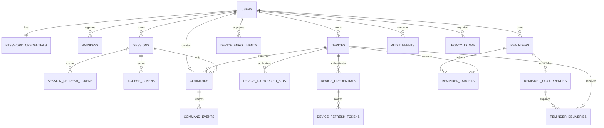

# Canonical data model

`DB/v2-canonical-schema.sql` is authoritative. This view groups tables by
ownership and shows the relationships most important to implementation.

## Ownership rules

- Identity owns users, password credentials, passkeys, sessions, refresh/access
  tokens, email tokens, the encrypted transactional email outbox, WebAuthn
  challenges and step-up grants.
- Devices owns devices, credentials, enrollment, presence/capabilities and local
  Windows SID authorizations.
- Commands owns command projections and append-only events.
- Reminders owns encrypted reminder definitions, targets, occurrences and
  deliveries.
- Operations owns outbox, audit, export/deletion, tombstones and legacy mapping.
- Foreign keys protect relationships, but module code may mutate only its owned
  tables. Cross-module behaviour goes through application interfaces.

## Identity and token representation

The database never stores a bearer/refresh token in usable form. `token_hash`
is a keyed digest; a database-only disclosure cannot authenticate without the
application-held hashing key. Rotation preserves old token records as
`rotated`, enabling reuse detection. Revocation is applied to the family and all
access tokens derived from it.

Passkeys store credential ID, public key, algorithm, sign counter, transports
and optional authenticator identifier. Private keys never reach PCConnect.

## Command ledger

The `commands` row is the current projection used for efficient reads and
claims. `command_events` is the immutable history and must contain sequence 1
for creation plus one event for each state change. Updating a command and
inserting its event/outbox message occurs in one database transaction.

The database trigger rejects illegal forward transitions. Application code also
enforces expiry, claim ownership, capability, step-up and actor authorization;
the trigger is defense in depth, not the complete policy.

## Reminder encryption and scheduling

The reminder row contains no plaintext column. Ciphertext, GCM nonce/tag,
wrapped data key and wrapping-key ID are stored together. Text associated data
is the versioned canonical encoding of reminder ID and owner ID. The data-key
wrapping operation separately binds the wrapping-key ID as its associated data.
Keeping these contexts separate permits master-key rotation to rewrap only the
random data key without invalidating the reminder text authentication tag.
`text_aad_version` makes a future format change an explicit data migration.

`local_start` plus IANA timezone preserves scheduling intent. Generated
occurrences persist their UTC instant and chosen offset. Deliveries snapshot the
eligible devices for that occurrence, so later device/target changes do not
rewrite history.

V2 reminder creation stores the actor session and `Idempotency-Key` as a unique
pair. Both are nullable only for imported legacy rows, which have no trustworthy
v2 actor session. This closes the original mismatch where the OpenAPI contract
required an idempotency key but the canonical schema could not enforce it.

## Retention defaults

| Data | Default retention |
|---|---|
| Active account/device/reminder | Until user deletion or explicit removal |
| Access token rows | 24 hours after expiry |
| Refresh-token history | 90 days after family expiry/revocation |
| Command projections/events | 12 months, then aggregate security counts only |
| Reminder deliveries | 90 days after acknowledgement/expiry |
| Security audit events | 12 months unless an incident hold applies |
| Ordinary application logs | 30 days |
| Ready export object | 48 hours |
| Deletion tombstone | Indefinite keyed digest with no recoverable identity |
| Legacy recovery snapshot | 90 days after day-60 sunset |

Retention values are configuration with lower-environment tests. Extending a
period requires a documented legal/operational reason and privacy review.
