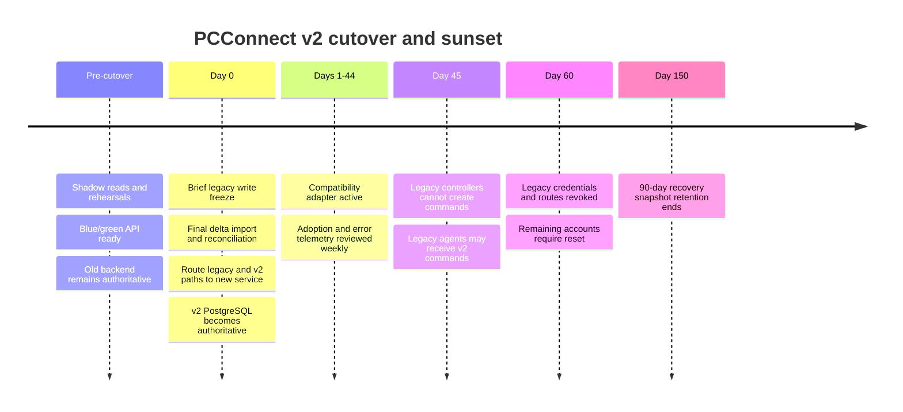

# Migration runbook

The repository SQL dump is not current production data. It must never be used as
the cutover source or committed in a new form.

## Gate 1 — containment and discovery

1. Rotate every source-exposed database, CAPTCHA, signing and application secret.
2. Inventory copies of the populated dump and signing material without deleting
   evidence needed for privacy/incident handling.
3. Obtain a read-only schema inventory and sanitized export from the live hosted
   database using an account that cannot write.
4. Record database engine/version, tables, columns, constraints, collations,
   triggers, row counts, timestamp formats, command values and client versions.
5. Complete `DB/legacy-mapping.md` with observed live columns. Any unresolved or
   lossy mapping is a cutover blocker.

## Gate 2 — importer and rehearsal

- The importer writes only to a disposable or empty v2 schema and accepts a
  `--dry-run` flag. It never mutates the legacy source.
- Each source row receives a stable v2 UUID recorded in `legacy_id_map`; reruns
  update/reconcile the same entity rather than duplicate it.
- Normalize usernames/emails/device names but preserve the original value for
  collision reporting. Collisions require an explicit deterministic resolution
  manifest reviewed before production.
- Quarantine malformed dates, invalid ciphertext, orphan records and unknown
  command strings. Do not silently invent values.
- Naive reminder timestamps use `Europe/London`, set `timezone_assumed=true`,
  and prompt the user after first v2 login.
- Emit a JSON reconciliation manifest conforming to
  `contracts/migration-manifest.schema.json`: counts, checksum, quarantines,
  collisions, duration and source snapshot identity; never include PII or
  credentials.
- Rehearse full and delta imports until two consecutive runs produce identical
  mappings/counts and all accepted differences are documented.

## Credential migration

- Import SHA-256 password verifiers into `password_credentials.legacy_sha256`
  only; application logs, exports and support tools cannot read this column.
- A v2 password login receives plaintext over TLS, compares a locally computed
  SHA-256 value once, replaces it with Argon2id in the same transaction and
  clears the legacy verifier. V2 never accepts a pre-hashed password.
- Accounts not upgraded by day 60 enter `reset_required`; their legacy verifier
  is erased after reset or at the end of the approved recovery window.
- Import legacy API keys as keyed HMAC values in
  `legacy_compat_credentials`, scoped only to named compatibility routes and
  stamped with the immutable day-60 expiry. They never mint v2 sessions.

## Cutover sequence

The compatibility adapter translates legacy endpoint shapes into v2 application
services. It does not write old tables, reproduce permissive CORS, accept new
legacy registrations or bypass v2 ownership checks. Compatibility traffic is
tagged by client generation and audited without credential values.

In accordance with ADR-019, legacy controllers can create only `lock` during
days 0–44. Commands requiring step-up are rejected from day 0 because an API
key cannot be promoted into a step-up proof. Users migrate to the v2 controller
for those operations.

In accordance with ADR-021, legacy reminder creation and delivery continue on
top of encrypted v2 reminder records through day 59. The compatibility adapter
does not accept recurrence or target selection, and it records both assumed time
zone semantics and the legacy credential actor. New v2 clients use the full
reminder contract.

## Validation and rollback

- Before unfreezing writes, compare source/target entity counts, deterministic
  samples, relationship integrity, reminder scheduling totals and the signed
  reconciliation manifest. Product and operations owners approve the gate.
- Before write cutover, rollback restores old routing and ends the freeze.
- During a short, explicitly recorded post-cutover safety window, rollback to the
  old system is allowed only if no v2 writes were accepted or a tested reverse
  journal covers every accepted write.
- Once normal writes resume, keep PostgreSQL and roll back the blue/green API
  image or disable new paths with feature flags. Never restore an old database
  over accepted v2 writes.
- Keep the old database encrypted and read-only. Test access monthly, restrict it
  to the incident/migration owner, then destroy it 90 days after day 60 with an
  auditable record.

## Exit criteria

- No legacy routes receive traffic for seven consecutive days before removal.
- All legacy credentials are revoked and cannot authenticate at any origin.
- Password migration/reset metrics, active agent versions and reminder counts
  meet the approved launch thresholds.
- Compatibility code and routing are removed from the deployable image, not
  merely hidden by a feature flag.
