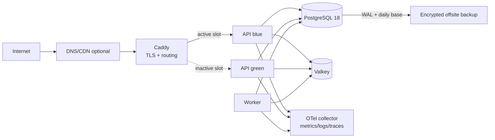

# Deployment and operations

## Production topology

Only ports 80/443 are public; port 80 permanently redirects to HTTPS. SSH is
key-only and source-restricted. PostgreSQL, Valkey, telemetry and Docker control
sockets are not publicly reachable. Containers use pinned image digests,
read-only filesystems where practical, non-root identities and explicit resource
limits.

## Environments and release

- Local development uses disposable Compose data and deterministic synthetic
  fixtures. Staging uses distinct secrets, RP origins, databases and volumes;
  it never receives unsanitized production data.
- CI builds immutable API/worker images, a signed WiX MSI and Android AAB. It
  publishes SBOMs, checksums and provenance with the release.
- Database changes follow expand/migrate/contract. The expansion applies before
  the green slot starts; destructive contraction occurs only after the rollback
  window and client compatibility range have ended.
- Readiness requires database access, migrations and encryption-key availability.
  Liveness checks only process health. `/version` reports release and contract
  versions without host or dependency secrets.
- Caddy switches traffic after readiness and smoke tests. The old slot remains
  stopped-but-runnable for the defined rollback window.

## Service objectives and capacity

| Measure | Initial objective |
|---|---:|
| Monthly availability | 99.5% |
| Concurrent realtime clients | 1,000 |
| Sustained API traffic | 50 requests/second |
| Sustained command creation | 10 commands/second |
| Command API latency | p95 ≤500 ms excluding step-up ceremony |
| Online command hint latency | p95 ≤2 seconds after commit |
| Recovery point objective | ≤15 minutes |
| Recovery time objective | ≤4 hours |

Capacity tests include Argon2 concurrency, hub connections, outbox backlog,
reminder expansion and PostgreSQL connection saturation on the production VPS
class. Admission/rate limits protect authentication memory and database pools.

## Observability

- Emit structured logs, OpenTelemetry metrics/traces and a correlation ID across
  edge, API, worker, outbox and email operations.
- Required metrics: request rate/error/latency, auth outcomes, token-family reuse,
  active connections, presence age, commands by state/age/failure, claim lease
  expiry, outbox depth/oldest age, reminder delivery lag, database pool usage,
  backup/WAL age and compatibility traffic by client generation.
- Alert on readiness failure, elevated 5xx/auth abuse, any token reuse, command
  backlog/expiry spikes, outbox age over 60 seconds, reminder lag over five
  minutes, disk over 80%, WAL archive failure, or backup age over 24 hours.
- Dashboards and support views show pseudonymous IDs. Access to security audit
  detail is restricted and itself audited.

## Backup and recovery

- Produce daily encrypted PostgreSQL base backups and continuous WAL archives to
  separate offsite storage. Back up reminder master-key escrow and ASP.NET Data
  Protection keys separately with dual-control access.
- Verify backup checksums automatically. Every month restore database and keys
  into an isolated environment, replay deletion tombstones and run API integrity
  smoke tests. A backup job succeeding is not evidence of restorability.
- Document total restore time and measured recovery point after every exercise;
  failure to meet RPO/RTO creates a release-blocking incident.

## Horizontal growth

API instances are stateless aside from shared Data Protection keys. Add replicas
behind Caddy and enable the Valkey SignalR backplane in the same data centre.
Workers claim PostgreSQL work with leases/advisory locks. Move PostgreSQL and
Valkey to managed/dedicated hosts later without changing REST, realtime, client
or domain contracts.
