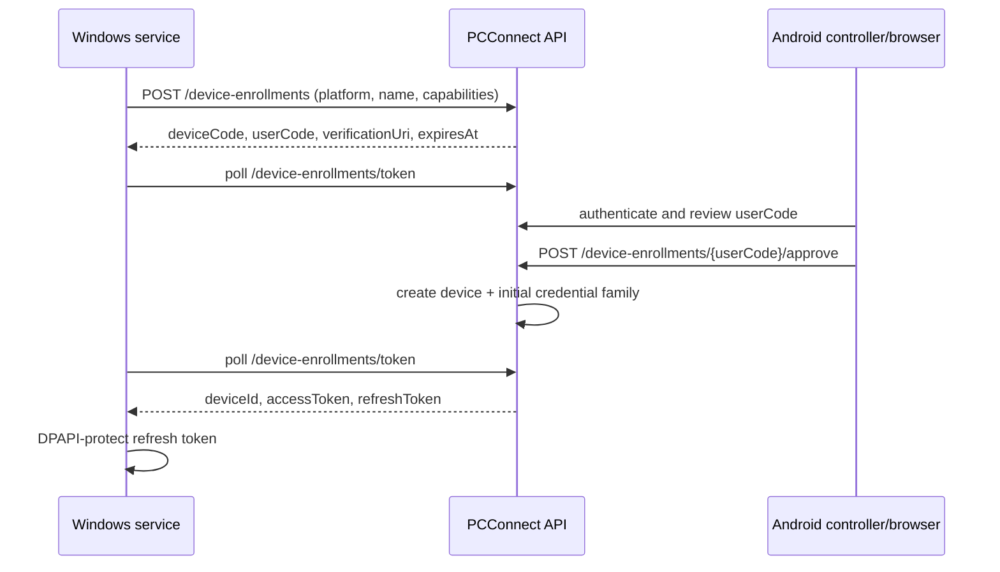
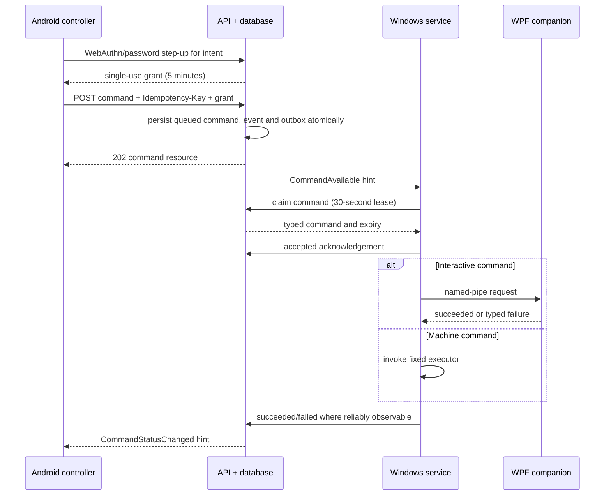

# Protocols and state machines

The REST source of truth is `contracts/openapi-v2.json`. This document explains
the cross-request behaviour that schemas alone cannot express.

## Authentication and sessions

- Access tokens are opaque 256-bit random values, stored only as keyed hashes,
  valid for ten minutes and accepted through `Authorization: Bearer`.
- User refresh-token families rotate on every use, have a 30-day sliding and
  90-day absolute expiry. Device credential families have a 90-day sliding and
  365-day absolute expiry. Reuse revokes the family and emits `SessionRevoked`.
- Passwords are sent only over TLS. Argon2id parameters are 64 MiB, three
  iterations, one lane, 16-byte salt and 32-byte output, recalibrated annually
  to approximately 250 ms without silently weakening existing hashes.
- Passkeys use WebAuthn with relying-party ID
  `pcconnect.adamdeveloping.co.uk`; authentication challenges expire after five
  minutes and are single use. User verification is required for step-up. The
  authentication-options request carries the same typed client descriptor as
  password login so the resulting session has an auditable platform, name and
  version.
- The RP host publishes Android Digital Asset Links for the approved application
  ID and signing-certificate lineage. The API allowlist includes the matching
  `android:apk-key-hash:` origin as well as the HTTPS web origin; release CI
  derives and verifies both public fingerprints from the protected signing key.
- Password reset, email verification and passkey addition revoke outstanding
  step-up grants. Password reset and account deletion also revoke all sessions.
- Verification and reset email links are verified Android App Links on the RP
  host. The one-time token is carried in the URL fragment so it is not sent to
  Caddy or included in access logs; the Android controller submits it directly
  to the appropriate anonymous API operation.
- A passkey step-up proof is the WebAuthn assertion credential object returned
  for `passkeyOptions`; the server requires user verification and binds the
  challenge to the authenticated session and requested intent.
- Registration requires username, verified email flow, display name, timezone,
  explicit marketing preference and an Argon2id password. Date of birth is
  optional; migrated values are preserved but new product behaviour cannot rely
  on age unless a separate product/privacy decision establishes that need.

## Device enrollment

- Device codes are 256-bit random values stored hashed; user codes are
  unambiguous eight-character codes, rate-limited and valid for ten minutes.
- Polling faster than the returned interval receives `slow_down` without
  changing approval state. `device_enrollments.last_polled_at` is updated under
  a row lock so concurrent pollers cannot bypass the interval.
- Approval displays platform, requested name and capabilities. Enrollment does
  not implicitly authorize a Windows user SID; the companion records that in a
  separate authenticated local authorization step.
- Device names are unique per user after Unicode normalization and case folding.

## Step-up and command creation

### Command invariants

- Allowed types are `lock`, `sleep`, `hibernate`, `sign_out`, `restart`, and
  `shutdown`. Payloads cannot contain paths, executable names or arguments.
- `sleep`, `hibernate`, `sign_out`, `restart`, and `shutdown` require a
  server-verified step-up grant bound to session, device, command type and
  idempotency key. `lock` requires an explicit-confirmation boolean.
- `Idempotency-Key` is a UUID and unique for the actor session for 24 hours.
  Repetition returns the original resource; it never creates another command.
- Commands expire after 120 seconds by default; clients may request 1–300
  seconds. Offline devices may not receive a command after expiry.
- A claim has a 30-second lease. A crashed claimant can be replaced only after
  lease expiry. A device uses the command ID as a local replay key.
- Legal states are `queued`, `claimed`, `accepted`, `succeeded`, `failed`,
  `expired`, and `cancelled`. `command_events` is append-only and the current
  row is an optimized projection.
- `accepted` is the last reliable acknowledgement for operations that terminate
  or suspend the machine/session. The controller says “accepted by device,” not
  “completed.” Lock may report `succeeded`; typed failures include
  `no_interactive_session`, `unsupported`, `permission_denied`, `expired`,
  `local_replay`, and `execution_failed`.

## Realtime and recovery

- Hubs publish only the five events in `contracts/realtime-v2.json`.
- Each envelope has `eventId`, `entityId`, `entityVersion`, `occurredAt`, and a
  typed payload. Clients ignore an entity version older than their local value.
- The service heartbeat interval is 30 seconds. Presence becomes offline after
  75 seconds without a current hub connection or heartbeat.
- Reconnect delays are 1, 2, 5, 10 and 30 seconds with ±20% jitter. REST fallback
  polling starts at 15 seconds and doubles to 60 seconds while the hub is
  unhealthy. A successful hub connection stops fallback polling only after a
  REST cursor catch-up.
- Agents recover available reminders through `GET /agent/reminder-deliveries`;
  the response is owner-scoped by the authenticated device credential.
- The outbox is claimed with `FOR UPDATE SKIP LOCKED`. Publication can be
  duplicated; consumers are idempotent by `eventId`. It cannot be lost after
  its domain transaction commits.

## Reminder scheduling and encryption

- A reminder has `all_devices` or `selected_devices` target mode, an IANA
  timezone, local start time and optional RFC 5545 recurrence rule.
- The worker generates occurrences in bounded windows and resolves daylight
  saving gaps by moving to the next valid local instant. Overlaps choose the
  earlier offset. The chosen UTC instant is persisted and never recalculated.
- Every occurrence expands to one delivery per eligible target device. Adding a
  device later does not change historical occurrences.
- Reminder text uses AES-256-GCM. Each row has a random 256-bit data key and
  nonce; the data key is wrapped by a versioned master key outside the database.
  Versioned text associated data binds ciphertext to reminder ID and owner ID;
  the separate data-key wrapping operation binds the wrapping-key ID.
- Rotation rewraps data keys without decrypting/re-encrypting reminder text.
  Loss of the master key is unrecoverable, so the key escrow is backed up and
  restore-tested separately from the database.
