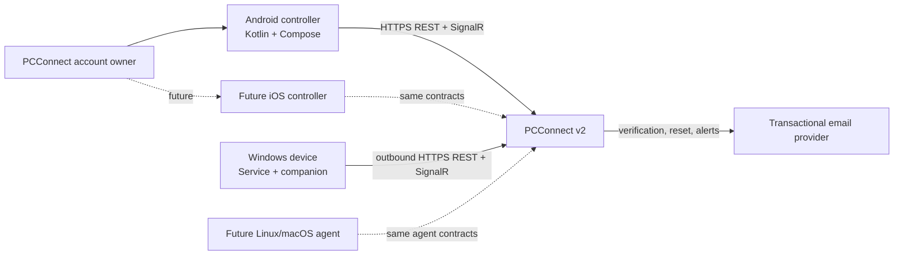
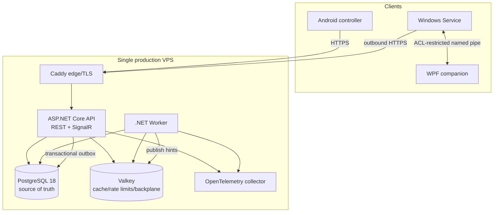
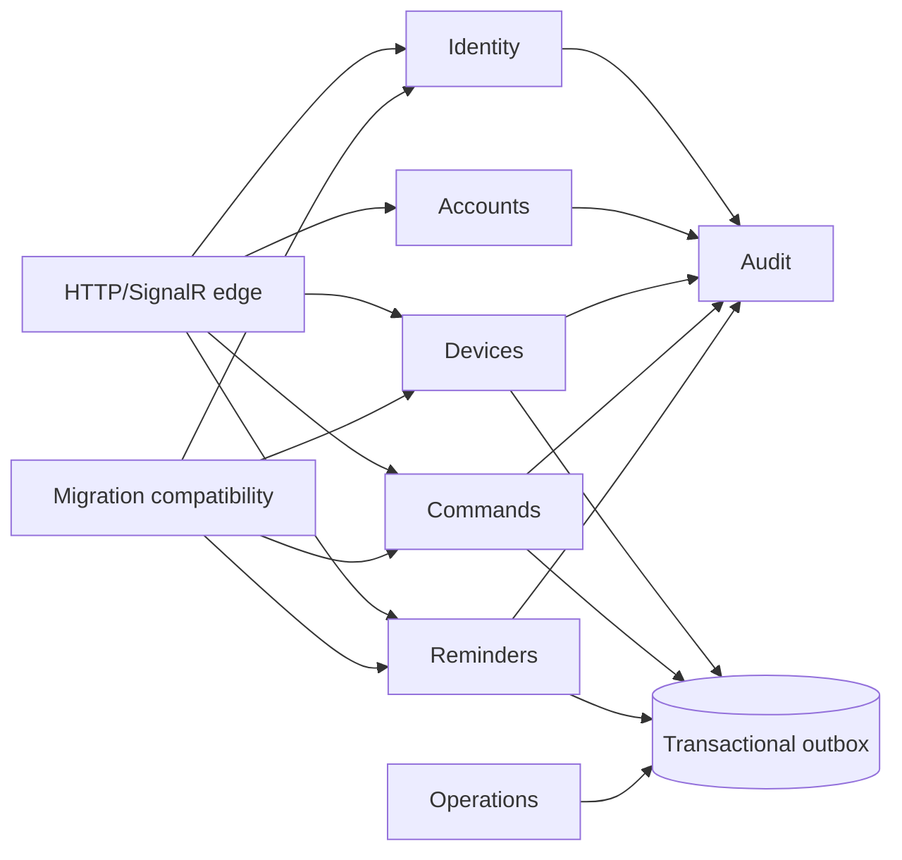
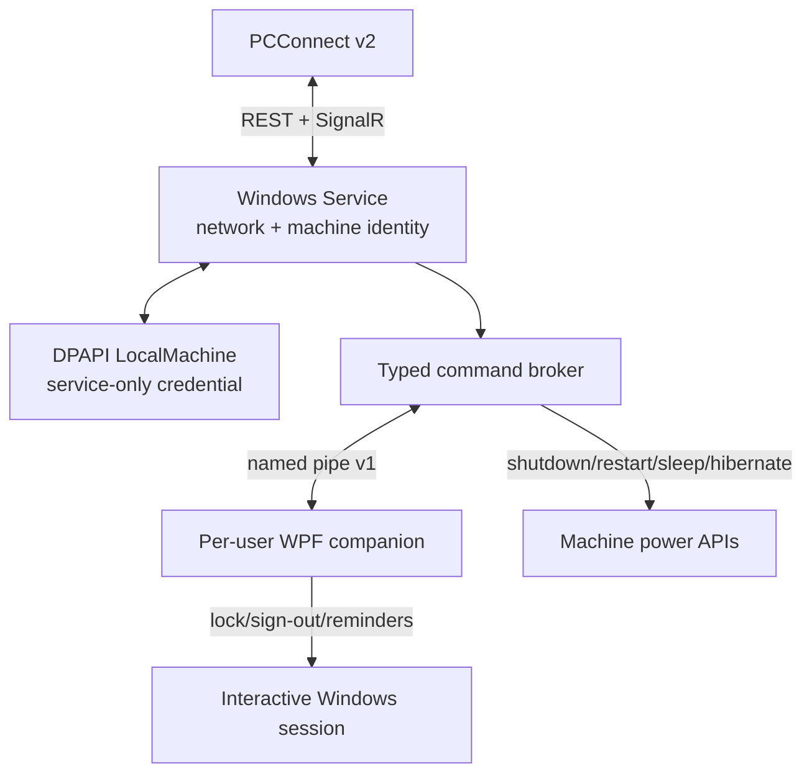

# System architecture

## Context

PCConnect never accepts inbound connections to a managed PC. Every device opens
an authenticated outbound connection to the public service.

## Containers

The API and worker are separate processes built from one .NET solution. The API
owns synchronous validation and transactions; the worker owns schedules,
outbox dispatch, expiry, export/deletion and retention jobs. Neither keeps
authoritative in-memory domain state.

## Backend modules

Modules have separate namespaces, application interfaces and table ownership.
Cross-module changes use application services inside the request transaction or
typed outbox messages after commit. Direct cross-module table writes are
forbidden. The first deployment is a modular monolith, not microservices.

## Windows runtime

- The service starts before sign-in, authenticates the enrolled device and owns
  command claims/acknowledgements.
- The service runs under a dedicated service identity with only the rights
  proven necessary. LocalSystem is allowed only if integration testing proves a
  virtual service account cannot perform required machine-level operations.
- The companion validates the server-issued operation and active user SID. It
  cannot ask the service to run arbitrary programs.
- Lock and sign-out fail with `no_interactive_session` when no approved session
  exists. Reminder deliveries remain pending until a companion connects.

## Android runtime

The Android controller uses Kotlin, Compose, coroutines/Flow, ViewModels,
Retrofit/OkHttp, Room, DataStore and WorkManager. It targets API 36 with minimum
API 24. Credential Manager passkeys are enabled on Android 9+; password login is
retained on API 24–27. Refresh credentials are wrapped by Android Keystore and
excluded from cloud backup and device transfer.

Room stores read models and cursors only. Commands, enrollment approvals,
credential changes, exports and deletion are online-only and are never placed
in an offline write queue.

## Extensibility contract

`platform` is descriptive rather than an authorization shortcut. Every agent
registers protocol version and capabilities. Server authorization checks the
user, device state, advertised capability, command risk and step-up grant.
Adding Linux/macOS therefore requires a new executor and secure local credential
store, not a backend route or schema change. An iOS controller consumes the same
controller contract and advertises no agent capabilities.
